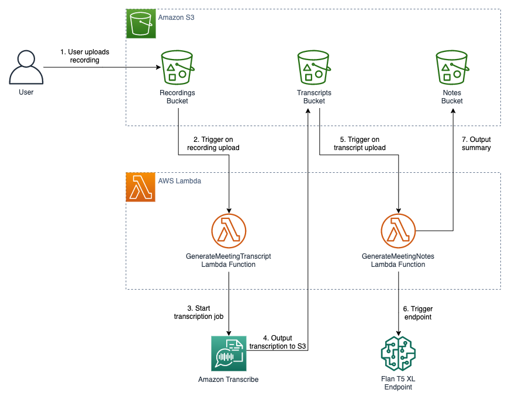

# Serverless Summarization Backend with Amazon SageMaker

This repository contains a solution for an automated meeting notes generator application leveraging Large-Language Models (LLMs) on SageMaker JumpStart, a machine learning (ML) hub that can help you accelerate your ML journey. 

Explore more foundation models on [SageMaker JumpStart](https://aws.amazon.com/sagemaker/jumpstart/getting-started/). 

## Disclaimer

The IAM roles and policies provided in the CloudFormation template are created to demonstrate the functionality of the demo solution. Apply the principles of least privilege to secure resources and their permissions for deploying into a production environment. Learn more about [Security best practices in IAM](https://docs.aws.amazon.com/IAM/latest/UserGuide/best-practices.html)

## Key Features
- Uses CloudFormation to automate deployment of all resources
- Uses Lambda functions with S3 upload triggers to create an automated workflow
- Uses Amazon Transcribe to transcribe audio/video meeting recordings
- Uses the [Flan T5 XL](https://aws.amazon.com/sagemaker/jumpstart/getting-started/?sagemaker-jumpstart-cards.sort-by=item.additionalFields.priority&sagemaker-jumpstart-cards.sort-order=asc&awsf.sagemaker-jumpstart-filter-product-type=*all&awsf.sagemaker-jumpstart-filter-text=*all&awsf.sagemaker-jumpstart-filter-vision=*all&awsf.sagemaker-jumpstart-filter-tabular=*all&awsf.sagemaker-jumpstart-filter-audio-tasks=*all&awsf.sagemaker-jumpstart-filter-multimodal=*all&awsf.sagemaker-jumpstart-filter-RL=*all&sagemaker-jumpstart-cards.q=Flan-T5-XL&sagemaker-jumpstart-cards.q_operator=AND) model from SageMaker JumpStart

## Architecture Diagram

<figure>
    
    <figure-caption>Figure 1. Solution architecture diagram.</figure-caption>
</figure>

## Deployment with CloudFormation

1. (Optional) Submit service quota requests to increase limits on instance capacity as desired.
2. Select deployment region
   - Choose an AWS Region that Amazon SageMaker JumpStart. The default is <code>us-east-1</code> and recommended.
   - If using a region other than <code>us-east-1</code>, update the <code>ImageURI</code> and <code>ModelData</code> using the documentation.
3. Create the Lambda layer
   1. Create a [Cloud9](https://us-east-1.console.aws.amazon.com/cloud9control/home) environment in the deployment region and open the Cloud9 IDE.
   2. In the Cloud9 IDE, open a new terminal and run the commands in [lambda_layer_script.sh](lambda_layer_script.sh)
   3. Verify in the [AWS Lambda page](https://us-east-1.console.aws.amazon.com/lambda/home) of the AWS Console that a layer called <code>demo-layer</code> has been created.
   4. Delete the Cloud9 environment.
4. Deploy CloudFormation template
   - (Optional) Adjust parameters:
     - <code>InstanceType</code>: instance type for SageMaker endpoint (default = <code>ml.p3.2xlarge</code>)
     - <code>InstanceCount</code>: number of instances for SageMaker endpoint (default = 1)
     - <code>ImageURI</code>: container URI for inference endpoint (default = <code>huggingface-pytorch-inference:1.10.2-transformers4.17.0-gpu-py38-cu113-ubuntu20.04</code>)
     - <code>ModelData</code>: S3 location of LLM model artifact (default = <code>huggingface-text2text-flan-t5-xl</code>)

## Solution Usage

1. Upload a meeting recording to the <code>recordings/</code> folder of the S3 bucket. Note: the recording must be in one of the  [media formats supported by Amazon Transcribe](https://docs.aws.amazon.com/transcribe/latest/dg/how-input.html).
2. Find the generated transcript in the <code>transcripts/</code> folder of the S3 bucket. It may take a few minutes for the transcripts to show up.
3. Find the generated notes in the <code>notes/</code> folder of the S3 bucket. It may take a few minutes for the notes to show up.

## Clean Up

1. Delete all objects in the demo S3 bucket.
2. Delete the CloudFormation stack.
3. Delete the Lambda layer.

## Security

See [CONTRIBUTING](CONTRIBUTING.md#security-issue-notifications) for more information.

## License

This library is licensed under the MIT-0 License. See the LICENSE file.
